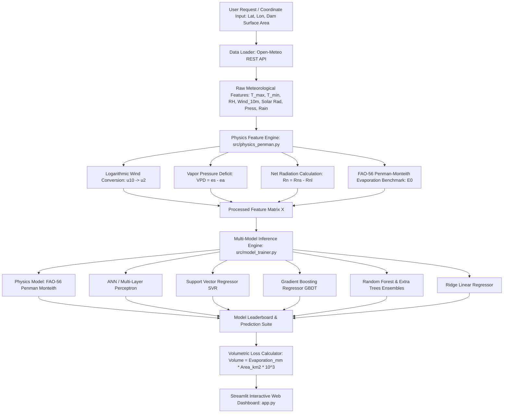

# 🏗️ System Architecture, Technical Stack & End-to-End Workflow

This document provides a comprehensive technical overview of **Hydra: AI-Based Reservoir Evaporation & Water Level Prediction System**. It details the system architecture, technology stack, comparison with conventional evaporation measurement methods, and the end-to-end data processing workflow.

---

## 1. Executive Summary & Existing Solutions vs. Proposed Innovation

### **The Problem & Existing Solutions**
Water reservoirs and dams lose millions of liters of freshwater daily due to open surface evaporation. Traditionally, irrigation and water management authorities estimate evaporation using **Class A Evaporation Pans** or **Basic Empirical Equations**:

```
[Conventional Approach]
Physical Evaporation Pan (Class A) ──> Manual Human Measurement ──> Empirical Kp Factor ──> Historical Estimate (No Forecast)
```

#### **Limitations of Existing Solutions:**
1. **Labor-Intensive & Error-Prone**: Requires daily physical visits to record water drop in the pan, leading to manual observation errors.
2. **Maintenance & Contamination Issues**: Pans suffer from algae growth, bird drinking, animal interference, debris buildup, and thermal boundary errors (metal walls of pans heat up differently than open reservoir water).
3. **No Predictive Capability**: Evaporation pans only measure past loss; they cannot forecast future evaporation for proactive water management.
4. **Location Lock-in**: Physical pans are fixed to specific weather stations; they cannot estimate evaporation for unmonitored dams or remote reservoirs.

---

### **Our Proposed System & Technical Superiority**

**Hydra** replaces manual pan monitoring with an automated, physics-informed machine learning system integrated with satellite meteorological APIs:

```
[Hydra Proposed Architecture]
Open-Meteo REST API / Hardware Sensors ──> Physics Feature Engine (FAO-56) ──> Multi-Model ML Regressors ──> Volumetric Loss Dashboard & 7-Day Forecast
```

#### **Key Advantages & Innovations:**
- **Zero Manual Overhead**: Automated data ingestion eliminates physical pan maintenance and human observation errors.
- **Predictive 7-Day Forecasting**: Integrates live satellite weather forecasts to project future reservoir water depletion.
- **Location-Agnostic Engine**: Supports any reservoir worldwide using latitude/longitude coordinates or custom local sensor CSV uploads.
- **Physics-Informed Accuracy ($R^2 = 0.9983$)**: Blends thermodynamic energy balance (FAO-56 Penman-Monteith) with machine learning ensembles (MLP, SVR, Gradient Boosting).
- **Actionable Volumetric & Decision Analytics**: Converts evaporation depth ($\text{mm}$) directly into volume loss ($\text{Liters}$ / $\text{Million m}^3$) and translates losses into real-world supply metrics (e.g. *"Equivalent to 3.2 days of drinking water supply for Pune City"*).

---

## 2. Technology Stack & Component Breakdown

```
┌─────────────────────────────────────────────────────────────────────────────────┐
│                                 PRESENTATION LAYER                              │
│                Streamlit 1.42+ Web Application Dashboard & Plotly UI            │
├─────────────────────────────────────────────────────────────────────────────────┤
│                                 APPLICATION LAYER                               │
│  Live 7-Day Forecast  │  Exploratory EDA  │  Model Leaderboard  │  Climate Shift │
├─────────────────────────────────────────────────────────────────────────────────┤
│                             MACHINE LEARNING & PHYSICS LAYER                    │
│  FAO-56 Penman Monteith  │  ANN / MLP  │  SVR  │  Gradient Boosting  │  Ridge    │
├─────────────────────────────────────────────────────────────────────────────────┤
│                                DATA & INGESTION LAYER                           │
│     Open-Meteo REST API  │  ERA5 Reanalysis Grid  │  Hardware Pan CSV Loader    │
└─────────────────────────────────────────────────────────────────────────────────┘
```

| Component Layer | Technology / Library | Purpose & Function |
|---|---|---|
| **Language & Runtime** | `Python 3.13` | Core execution environment for pipeline, physics formulas, and ML training. |
| **Data Ingestion** | `requests`, `Open-Meteo API` | Real-time and historical weather data fetching across global coordinates. |
| **Physics & Math** | `numpy`, `pandas`, `math` | Thermodynamic Penman-Monteith equation solver, logarithmic wind profile conversion, VPD calculation. |
| **Machine Learning** | `scikit-learn 1.6+`, `joblib` | Model pipelines (Ridge, SVR, Random Forest, Extra Trees, Gradient Boosting, MLPRegressor) & artifact serialization. |
| **Data Visualization** | `plotly 7.1+`, `seaborn`, `matplotlib` | Interactive time-series plots, correlation heatmaps, feature distribution visualizers. |
| **User Interface** | `streamlit 1.42+` | Reactive web dashboard, sidebar location selectors, volumetric loss calculators, climate sliders. |

---

## 3. End-to-End System Architecture & Data Workflow



---

## 4. Module Specifications

### **Module 1: Data Ingestion Engine (`src/data_loader.py`)**
- Connects to Open-Meteo REST API (`https://archive-api.open-meteo.com/v1/archive` & `https://api.open-meteo.com/v1/forecast`).
- Extracts daily weather parameters for any latitude/longitude.
- Converts 10-meter wind speed ($u_{10}$) to 2-meter wind speed ($u_2$) using atmospheric logarithmic boundary profile.
- Implements automated fallback data generation to ensure offline resilience.

### **Module 2: Physics Engine (`src/physics_penman.py`)**
- Calculates daily saturation vapor pressure ($e_s$), actual vapor pressure ($e_a$), Vapor Pressure Deficit ($VPD$), psychrometric constant ($\gamma$), slope of saturation vapor pressure curve ($\Delta$), and net radiation ($R_n$).
- Solves the full FAO-56 Penman-Monteith equation for open water reference evaporation ($E_0$).
- Applies pan coefficient calibration ($K_p = 0.75$) to establish ground-truth hardware pan baseline ($E_{pan}$).

### **Module 3: Machine Learning Engine (`src/model_trainer.py`)**
- Splits dataset into 80% past train and 20% future test splits using temporal sequence preservation.
- Trains 6 ML/DL model architectures plus physics baseline.
- Computes comprehensive evaluation metrics:
  - Coefficient of Determination ($R^2$)
  - Root Mean Squared Error ($\text{RMSE}$)
  - Mean Absolute Error ($\text{MAE}$)
  - Nash-Sutcliffe Efficiency ($\text{NSE}$)
  - Mean Absolute Percentage Error ($\text{MAPE}$)
- Serializes trained pipelines into `models/trained_models.pkl`.

### **Module 4: Web Application & Analytics Dashboard (`app.py`)**
- **Live Forecast Tab**: Interactive 7-day predicted evaporation depth and daily volume loss in Liters/MCM.
- **Exploratory Data Analysis Tab**: High-resolution diagnostic heatmaps and seasonal patterns.
- **Model Leaderboard Tab**: Performance metrics comparison and test set time-series alignment plots.
- **Volumetric Loss Calculator Tab**: Storage depletion gauge chart and drinking water supply equivalence.
- **Climate Shift Simulator Tab**: Interactive sliders for temperature, wind speed, and humidity sensitivity analysis.
